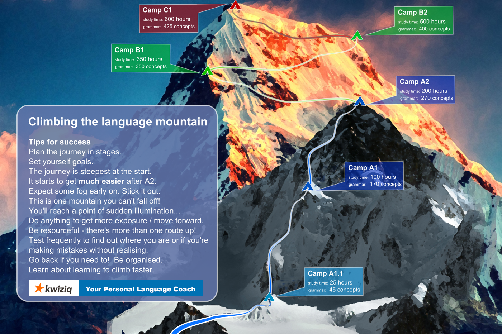

<!-- .slide: data-background="#2aa198" -->
<!-- .slide: data-state="terminal" -->

# How to Start Learning a Foreign Language

By <a href="http://austinlouden.com">Austin Louden</a> / <a href="https://www.pinterest.com/austinlouden/"><i class="fa fa-pinterest" aria-hidden="true"></i>austinlouden</a> / <a href="http://twitter.com/bkase_">@austinlouden</a> 

!!!

### One way to think of language learning

1. Duolingo, Rosetta Stone, etc.
2. ???
3. Fluency


Note: assuming you can't live in a foreign country, or don't have any relatives that can help you

!!!

### Problem


!!!

### My background

| Language | Time | Ability |
| -------- | ------ | ----- |
| Latin | 4 years | Terrible |
| Italian | 1 years | Terrible |
| Spanish | 6 months | Pretty good |
| German | 3 months | Meh |
| French | 3 months | OK |

Note: I don't know if Latin has helped. Get to college, placed into Spanish 2, but I didn't take it bc 8am.

!!!

### Learning a language isn't hard — it's just long



Note: The hardest part is at the beginning.

!!!

### Learn pronunciation first

Note: people shy away bc they're worried about how they sound

!!!

### We don't use that many words


Note: Randall Munroe of xkcd, up goer five = Saturn V Rocket

!!!

### Coverage

| Words | Coverage |
| -------- | ------ |
| 1000 | 80% of text |
| 2000 | 85% of text |
| 3000 | 89% of text |

Note: this comes from a fascinating read about how Routledge makes their frequency dictionaries (with 100 mil words as input) https://www.scribd.com/doc/35527699/Spanish-Word-Frequency-Study ALSO these numbers are usually higher coverage for spoken because speech tends to be much more repetitive. Things are broken down by ranges and compared, e.g. fiction text vs. scientific textbooks, etc.

!!!

### In general

| Words | Rule of thumb |
| -------- | ------ |
| 250 | the core of a language |
| 750 | used every day by people who speak the language |
| 2500 | everything you could possibly want to say, albeit awkwardly |
| 5000 | native speakers without higher education |
| 10000 | native speakers with higher education | 
| 20000 | passively read, understand, and enjoy a work of literature such as a novel by a notable author |

Note: Spanish, 4k words = 90%. linguists use the term lexeme. Alexander Argüelles prof at American University. After learning several languages

!!!

### Good news

```
10 words a day * 365 days = 3,650 words
```

Note: puts you somewhere between everything you could want to say and a native speaker without higher education

!!!

### Tools

!!!

### 4 Elements of learning a language

- Speaking
- Listening
- Reading
- Writing

Note: Different tools are designed for different things. Don't expect one tool to take you from zero to proficiency.

!!!

### SRS

(image)

Note: the scene where neo is in the chair, then wakes up and says I KNOW KUNG FU

!!!

### How to Make Good Flashcards

- No English! Use images instead
- 3 cards for every word: Recognition, Recall, and Comprehension

Note: Some strategies in the book Fluent Forever by Gabriel Wyner. Use google images in your target language if you can, because you'll often notice differences. E.g. in French, camion means truck, but it's usually used to describe a semi truck.

!!!

### Speaking

Look for things that require you to _produce_ the language.

- Michel Thomas
- Pimsleur 

Note: THE thing you want to focus on

!!!


### Summary

!!!

### There's a more detailed method to language learning

1. Learn pronunciation
2. Learn about 700 words with SRS
3. Learn some basic grammar
4. Learn to say or write simple things
5. Have simple conversations with a native speakers
6. Continue speaking, listening, learning vocabulary and grammar 
7. Fluency?

!!!

### Good things to remember

- Consistency is key — learning is long, not hard
- Focus on the common words
- Learn pronunciation first
- Pick the right tools for the job

!!!


