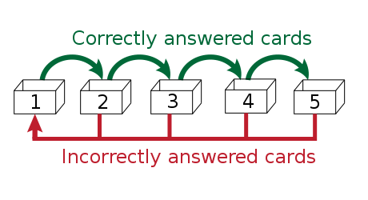

<!-- .slide: data-background="#2a6fa1" -->
<!-- .slide: data-state="terminal" -->

# How to Start Learning a Foreign Language 
By <a href="http://austinlouden.com">Austin Louden</a> / <a href="https://www.pinterest.com/austinlouden/"><i class="fa fa-pinterest" aria-hidden="true"></i>austinlouden</a> / <a href="http://twitter.com/bkase_">@austinlouden</a> 


Note: excited to tell you about one of my favorite things to do in free time,
learning languages

!!!

### What to take from this talk

- What tools should I use?
<!-- .element: class="fragment" data-fragment-index="1" --> 
- How do I go from using those tools to having conversations?
<!-- .element: class="fragment" data-fragment-index="2" -->

Note: By the end of this talk, I want to help you answer two key questions
when learning a language
- there are a lot of tools beyond duolingo to help leaning. A lot are good
at different things. I'll give some advice on which ones to use.
- this is a very important question to answer, especially if you're
staying in the US, and have no family or friends that speak the language
you're trying to learn.

!!!

### What we'll cover

1. Foundations
<!-- .element: class="fragment" data-fragment-index="1" --> 
2. Tools
<!-- .element: class="fragment" data-fragment-index="2" --> 

Note: 
- I'll start by talking about some foundations. These are ideas or
premises that can help guide what stuff you choose study, and they
heavily influence what I'll talk about in the next part.
- Then, in the second part, I'll talk about specific tools or tactics
that put those principles into practice.
TRANSITION: but before we start, I'll give you a quick overview of
my language-learning background.

!!!

### My background

| Language | Time | Ability |
| -------- | ------ | ----- |
| Latin | 4 years | Terrible |
| Italian | 1 year | Meh |
| Spanish | 6 months | OK (B1/B2) |
| German | 4 months | Meh (A2) |
| French | 3 months | OK (A2) |

Note: took 4 years of Latin in school. Was terrible. Took Italian in college
and that didn't work out too well either.

But I was still fascinated by people who could speak several languages
fluently. So I decided to try Spanish. Ended up spending a month in 
Barcelona where I only spoke Spanish.

!!!


### Part One: Foundations

!!!

### 1. Learning a language isn't hard — it's just long


Note: The hardest part is at the beginning.

!!!

### 2. Learn the sounds and pronunciation first

Note: If there's one thing that I've seen recent consensus about,
in language learning books, blogs, etc. — it's that learning
pronunciation is perhaps the most important. It's funny, because in
school, this is probably the area where we place the least effort.
- TRANSITION: I think this is more for reasons of scale and not for reasons of value.

!!!

### Scale vs. Value

- easy for teachers to give tests about vocab, reading, and writing
<!-- .element: class="fragment" data-fragment-index="1" --> 
- easy for apps to test fill-in-the-blank vocab
<!-- .element: class="fragment" data-fragment-index="2" --> 

Note: 
- easy for teachers to give exams about vocabulary, reading or writing
- easy for apps to mostly give you fill in the blank vocab because testing
pronunciation is hard

!!!

### Two approaches to learning

- Reading and Writing
<!-- .element: class="fragment" data-fragment-index="1" -->
- Speaking and Listening
<!-- .element: class="fragment" data-fragment-index="2" -->

Note: At a higher level, there are two approaches to language learning.
Most people, because it's the most convenient, or most
available, learn the skillset of reading and writing
TRANSITION: I think there are a lot of pitfalls to this approach.

!!!

### Common pitfalls of learning by reading and writing

Note: When you look at the problems people often say they have
when learning a language, the community has noticed that many
of these can be traced back to an education that based mostly on
reading and writing.

!!!

### Pitfall #1

"I know a lot of vocab, but _native speakers speak too quickly for
me to understand_"

Note: if you don't know a word by how it sounds, you will never
be fast enough to take the words you're hearing, imagine them in text
form, and then map that to a translation in your brain. You need to go
straight from sounds to meaning.

!!!

### Pitfall #2

"I can write well, but *I can't speak."*

Note: a lot of this comes from fear of mispronouncing things

!!!

### Pitfall #3

"Native speakers *can't understand my accent"*

Note: this can come from reading a lot before you understand how to pronounce
things. You voice the words in you're head and internalize wrong
pronunciations. You're not learning French, you're learning a third
language, that's somewhere between English and French, that only you
know.

!!!


### 3. Focus on the most frequently used words


Note: As part of Thing Explainer, Randall Munroe of xkcd, up goer five = Saturn V Rocket

!!!

### Coverage

| Words | Coverage |
| -------- | ------ |
| 1000 | 80% of text |
| 2000 | 85% of text |
| 3000 | 89% of text |

Note: this comes from a fascinating read about how Routledge makes their frequency dictionaries (with 100 mil words as input) https://www.scribd.com/doc/35527699/Spanish-Word-Frequency-Study ALSO these numbers are usually higher coverage for spoken because speech tends to be much more repetitive. Things are broken down by ranges and compared, e.g. fiction text vs. scientific textbooks, etc.

!!!

### In general

| Words | Rule of thumb |
| -------- | ------ |
| 250 | the core of a language |
| 750 | used every day by people who speak the language |
| 2500 | everything you could possibly want to say, albeit awkwardly |
| 5000 | native speakers without higher education |
| 10000 | native speakers with higher education | 
| 20000 | passively read, understand, and enjoy a work of literature such as a novel by a notable author |

Note: Spanish, 4k words = 90%. linguists use the term lexeme. Alexander Argüelles prof at American University. After learning several languages

!!!

### Good news

```
10 words a day * 365 days = 3,650 words
```

Note: puts you somewhere between everything you could want to say 
and a native speaker without higher education.
But of course, there's more to langauge than vocab.

!!!

### Part Two: Tools

Note: second part of the talk, tools or tactics. So, if you agree
with the foundations in the first part, how do you put those into practice?

1. learning a language isn't hard, it's long
2. start with sounds and pronunciation
3. learn the most common words first

TRANSITION:

!!!

### When I started...

1. Duolingo, Rosetta Stone, etc.
<!-- .element: class="fragment" data-fragment-index="1" -->
2. ???
<!-- .element: class="fragment" data-fragment-index="2" -->
3. Fluency
<!-- .element: class="fragment" data-fragment-index="3" -->

Note: 
TRANSITION: I soon realized that different tools are good at
different things.

!!!

### Different tools are good at different things

- Speaking
- Listening
- Reading
- Writing

Note: Don't expect one tool to take you from zero to proficiency.
TRANSITION: also there is one tool, or type of tool that's pretty good
at listening, reading and writing, something called Spaced Repitition
Software

!!!

### Spaced-Repetition Software (SRS)


Note: the scene where neo is in the chair, then wakes up and says I KNOW KUNG FU
SRS can be good for all four elements, and I can show you what I mean
by that later.

!!!

### SRS?



Note: based on this idea by a German scientist, Sebastian Leitner
So lernt man lernen (How to learn to learn)
- basic principle is this. Imagine you have a series of boxes with flash
cards in them. Each box you review at different intervals, so say the
first box has cards you review every day.
- if you get it right you move it to the next box, which you might
review every other day and so on.
- if you get something wrong, it goes all the way back to the beginning.

!!!

### SRS Recommendations

Note: two recommendations, both are free.

!!!


# Anki

- download decks or make your own
<!-- .element: class="fragment" data-fragment-index="1" -->
- generate multiple cards based on a certain set of data
<!-- .element: class="fragment" data-fragment-index="2" -->

Note: TRANSITION: I can tell you how I make my flash cards in Anki

!!!

### How to Make Anki Flash cards

- No English! Use images instead
<!-- .element: class="fragment" data-fragment-index="1" -->
- 3 cards for every word
<!-- .element: class="fragment" data-fragment-index="2" -->

Note: 
- there have been many studies about this, images trigger much more in
the brain. There's also a good exercise from a book called Fluent Forever,
which suggests you should find your examples on say, google.fr. Camion = semi
- the other huge benefit to Anki is that you can generate many different
flashcards with the same data.

TRANSITION: mentioned that you could do generate multiple cards for a certain
set of of data, so I usually generate 3, here's what they look like.

!!!

### 3 distinct cards

Data:
- French word
- image
- IPA
- gender and part of speech
- audio

| Front | Back | 
| -------- | 
| French word | image, audio... | 
| Image | French word, audio... | 
| Audio | French word, image... | 


!!!

### Memrise

- Memrise 
https://www.memrise.com/

Note: Memrise has a really polished mobile app and courses made by
professionals. All their cards have audio (and most other deck have
audio as well)

!!!


### Speaking

Look for things that require you to _produce_ the language.

- Michel Thomas
- Pimsleur 
- iTalki

Note: THE thing you want to focus on

!!!


### Listening

- Pimsleur
- Easy languages (YouTube)
- Minimal pairs
- iTalki

!!!

### Writing

- journal
- Lang-8 (http://lang-8.com/)

!!!


### Reading

- read a book you've already read before (childhood favorites)


!!!

### Summary

!!!

### There's a more detailed method to language learning

1. Learn pronunciation
2. Learn about 700 words with SRS
3. Learn some basic grammar
4. Learn to say or write simple things
5. Have simple conversations with a native speakers
6. Continue speaking, listening, learning vocabulary and grammar 
7. Fluency?

!!!

### Good things to remember

- Consistency is key — learning is long, not hard
- Focus on the common words
- Learn pronunciation first
- Pick the right tools for the job

!!!


