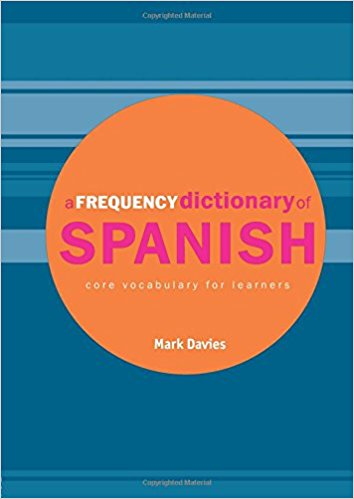
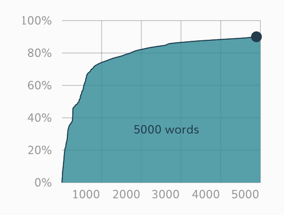
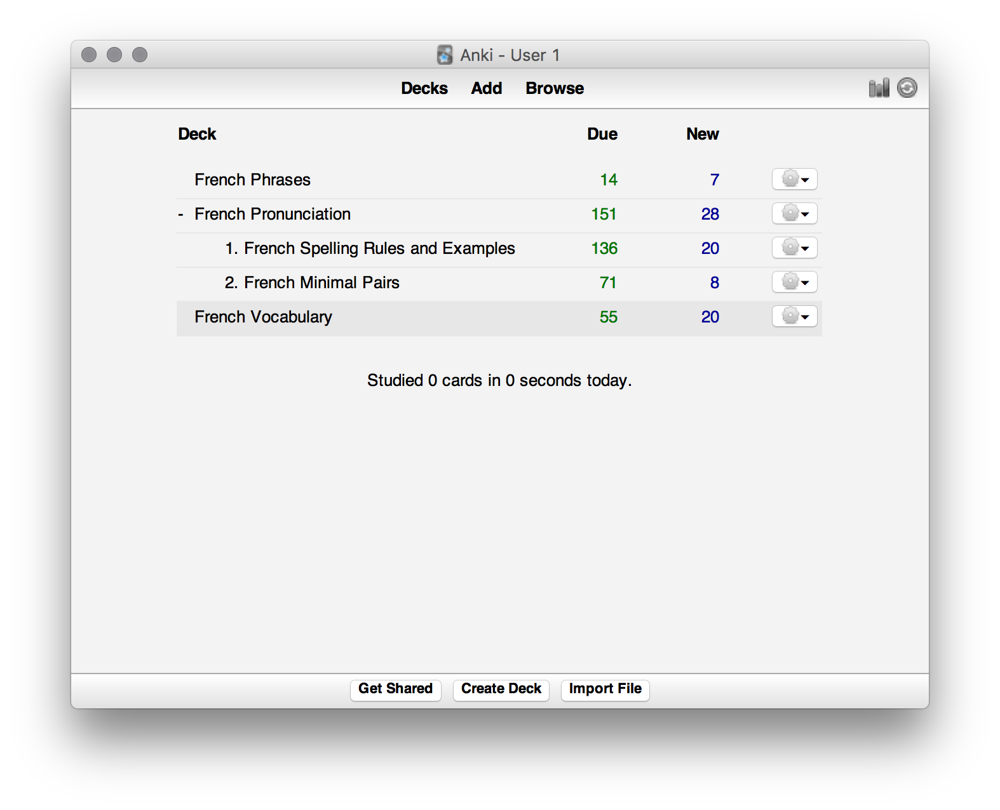
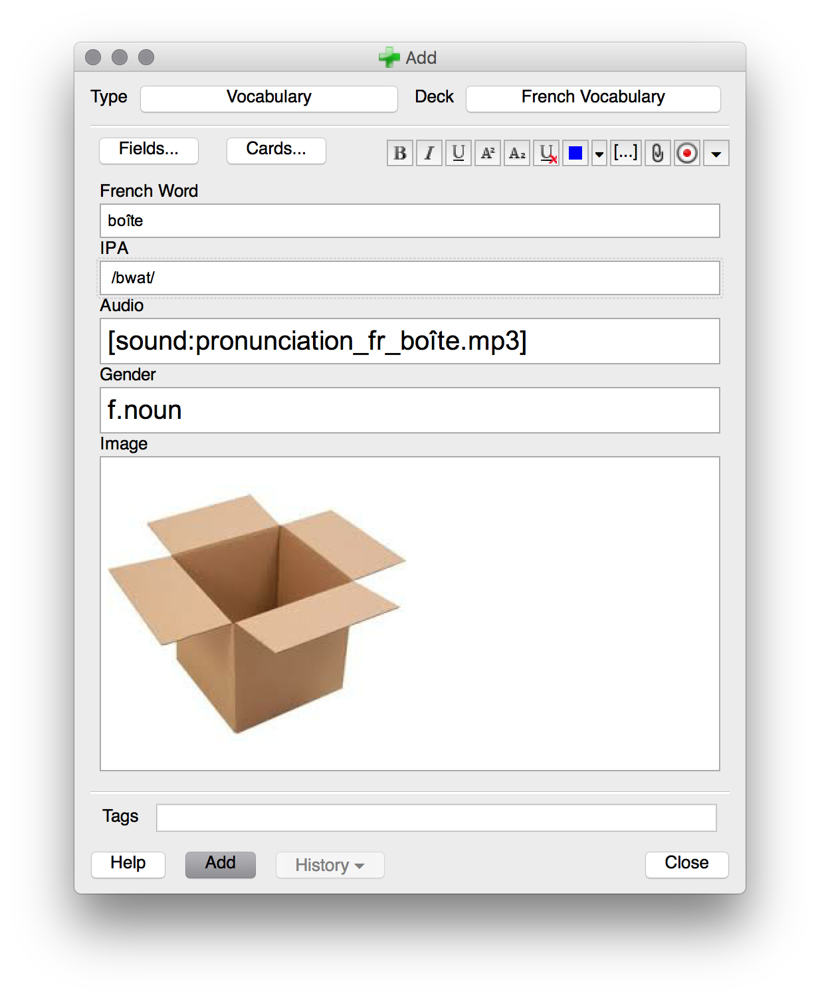
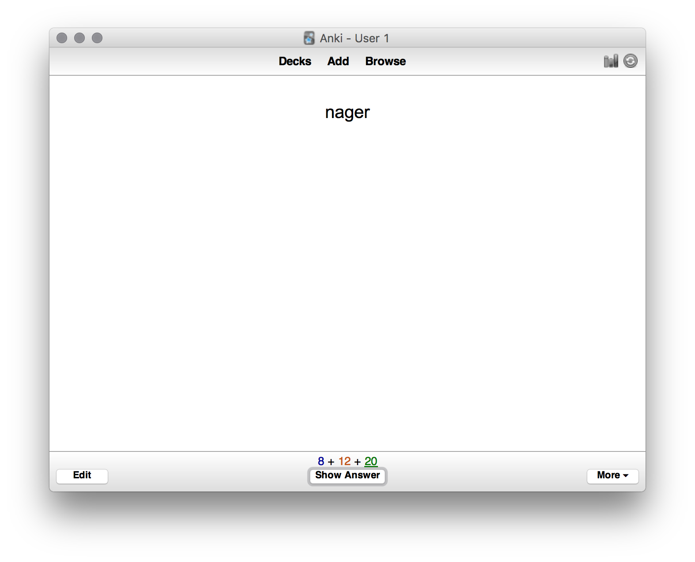
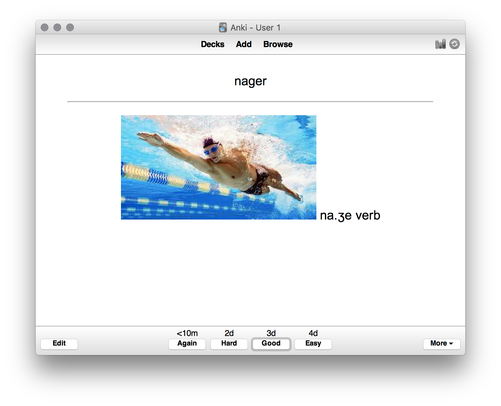
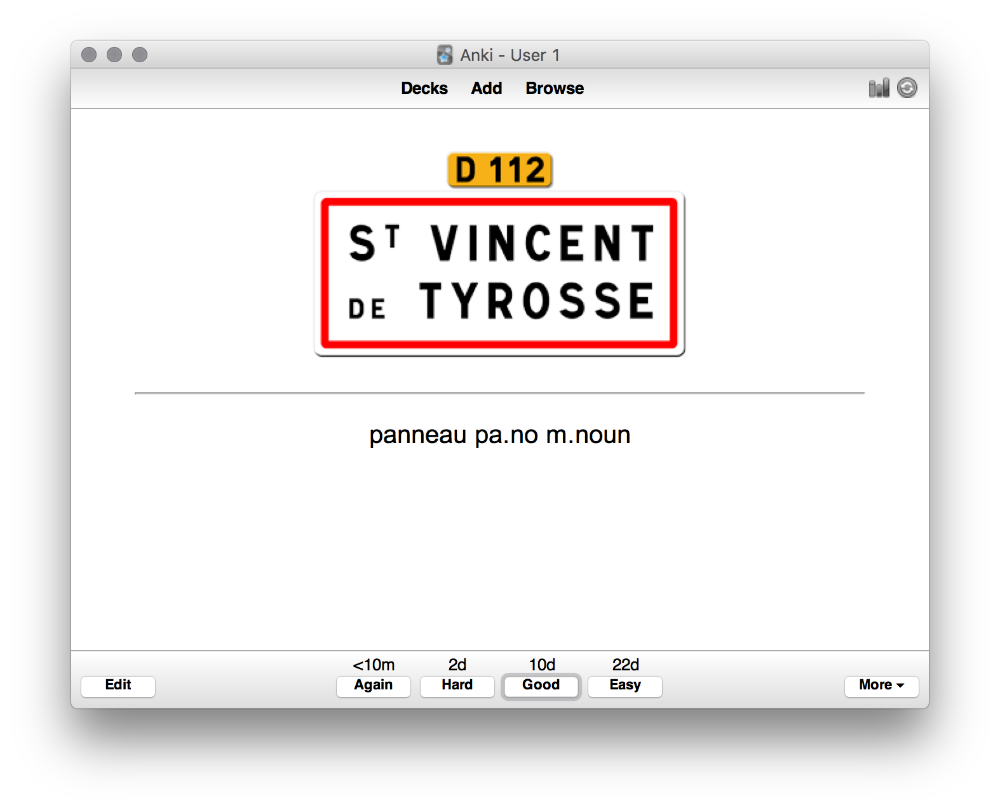
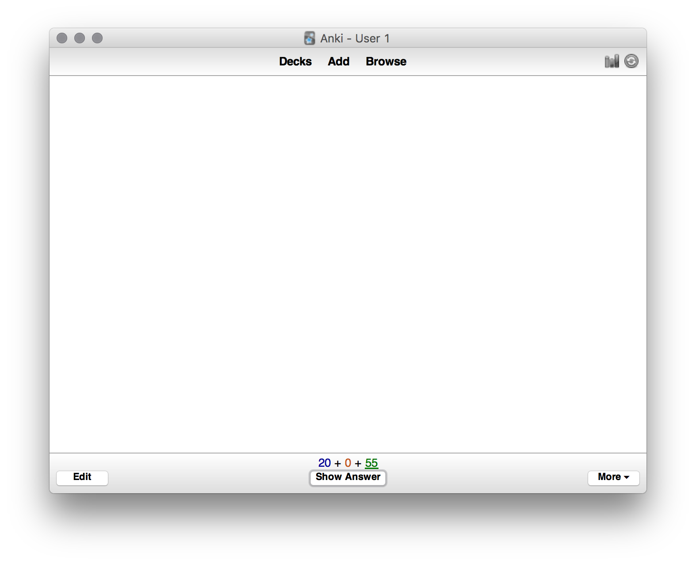
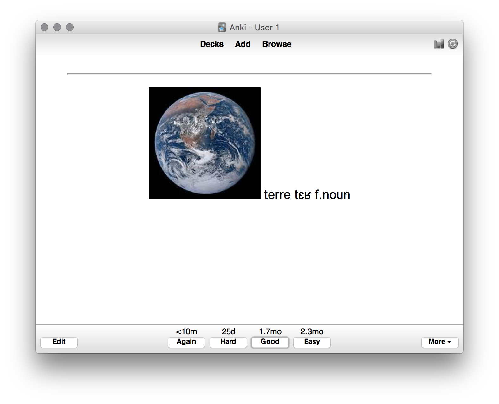
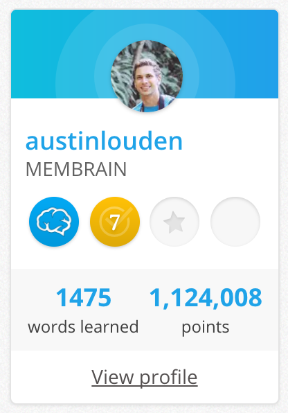

<!-- .slide: data-background="#2a6fa1" -->
<!-- .slide: data-state="terminal" -->

# How to Start Learning a Foreign Language 
By <a href="http://austinlouden.com">Austin Louden</a> / <a href="https://www.pinterest.com/austinlouden/"><i class="fa fa-pinterest" aria-hidden="true"></i>austinlouden</a> / <a href="http://twitter.com/bkase_">@austinlouden</a> 


Note: thanks for coming 
excited to tell you about one of my favorite things to do in free time,
learning languages

!!!

### What to take from this talk

- What tools should I use?
<!-- .element: class="fragment" data-fragment-index="1" --> 
- How do I go from using those tools to having conversations?
<!-- .element: class="fragment" data-fragment-index="2" -->

Note: What I hope you'll take away from this talk are the answers to
two key questions:
- there are a lot of tools out there to help you learn. Some tools are good
at different things. I'll give some advice on which ones to use.
- what does the process look like from using tools to having conversations?
this is a very important question to answer, especially if you're
staying in the US, and have no family or friends that speak the language
you're trying to learn.

TRANSITION: but before we start, I can give you a short overview of my
language learning background

!!!


### My background

Latin, Italian, _Spanish_, German, _French_

Note: I am by no means fluent in any of them, but I would say that
I can hold conversations in a few of them, most notably Spanish and French.

TRANSITION: related to that, I should make the distinction between
"flunecy" and "conversational fluency"

!!!

### Goal: Conversational fluency

- know around 3,000 words
<!-- .element: class="fragment" data-fragment-index="1" --> 
- express anything, although sometimes in indirect ways
<!-- .element: class="fragment" data-fragment-index="2" --> 
- people understand what you say
<!-- .element: class="fragment" data-fragment-index="3" --> 
- you understand people well enough to identify specific words you don't know
<!-- .element: class="fragment" data-fragment-index="4" --> 

Timeline: about a year
<!-- .element: class="fragment" data-fragment-index="5" --> 

Note: what we're shooting for here, is 0 to conversational fluency.
Everyone has there own definition of conversational fluency. Here's my
personal impression

Timeline for these goals can be as short as a year,
depending on how much you study

TRANSITION: Now that we know more about what we're aiming for, we can
talk about strategy

!!!

### Part One: Strategy

Note: so, part one is strategy, part two is tactics.

TRANSITION: There are two parts to the strategy. The first is...

!!!

### 1. Learn the sounds and pronunciation first

Note: If there's one thing that I've seen recent consensus about,
in language learning books, blogs, etc. — it's that learning
pronunciation is perhaps the most important. It's funny, because in
school, this is probably the area where we place the least effort.
- TRANSITION: I think this is more for reasons of scale and not for reasons of value.

!!!

### Scale vs. Value

- easy for teachers to give tests about vocab, reading, and writing
<!-- .element: class="fragment" data-fragment-index="1" --> 
- easy for apps to test fill-in-the-blank vocab
<!-- .element: class="fragment" data-fragment-index="2" --> 

Note: 
- easy for teachers to give exams about vocabulary, reading or writing
- easy for apps to mostly give you fill in the blank vocab because testing
pronunciation is hard

!!!

### Two approaches to learning

- Reading and Writing
<!-- .element: class="fragment" data-fragment-index="1" -->
- Speaking and Listening
<!-- .element: class="fragment" data-fragment-index="2" -->

Note: At a higher level, there are two approaches to language learning.
Most people, because it's the most convenient, or most
available, learn the skillset of reading and writing
TRANSITION: I think there are a lot of pitfalls to this approach.

!!!

### Common pitfalls of learning by reading and writing

Note: In my experience, most of the difficulties I've heard from
people learning languages fall into one of these three buckets.


!!!

### Pitfall #1

"I know a lot of vocabulary, but _native speakers speak too quickly_ for
me to understand"

Note: so this is a challenge regardless of how you learn a language
because it takes time to get accustomed to processing new sounds quickly.

But it's even more challenging if you're not familiar with the sounds of
words at all, but only how they look on paper of flashcards

!!!


### Pitfall #1 cont.

Sounds -> what does this word look like on paper? -> meaning


_Sounds -> meaning_
<!-- .element: class="fragment" data-fragment-index="1" -->


Note:
- so if you're having a conversation with someone, even if you're
not aware of it, you brain might be doing something like this
- instead, we want to focus on tools that help us go directly from
sounds to meaning

!!!

### Pitfall #2

"I can write well, but *I can't speak."*

Note: I often felt this way because I was afraid of mispronoucing things.
I also wasns't tools that would challenge me to speak or build sentences
quickly in my head.

!!!

### Pitfall #3

"Native speakers *can't understand my accent"*

Note: French is notorious for this. For example, take a look at this word.

!!!

### Pitfall #3 cont.

_froid_

/fʁwa/ : cold
<!-- .element: class="fragment" data-fragment-index="1" -->

Note: In English, we might think this is
pronounced like froid, and if we were reading a French text and came 
across it, we might guess it was pronounced more or less the same, but
with a French accent.

It's actually pronounced fwa, and it means cold. But if we han't known
that, then we've just been set back a bit by internalizing an incorrect
pronunciation.

In that case, we're not actually learning French, we're learning some third
language, that's somewhere between English and French.

!!!

### What do these pitfalls have in common?

Each one has to do with _understanding and speaking_.
<!-- .element: class="fragment" data-fragment-index="1" -->

!!!

### How does a focus on sounds and pronunciation help?

- Go straight from sound to meaning
<!-- .element: class="fragment" data-fragment-index="1" -->
- Pronunciation gives you confidence to speak
<!-- .element: class="fragment" data-fragment-index="2" -->
- Natives speakers will understand you better if you focus on accent
<!-- .element: class="fragment" data-fragment-index="3" -->


Note: 
- that means associating a sound with every word you learn

TRANSITION: that covers the first of our strategy. I'd say there's one
more that's equally important.

!!!

### 2. Focus on the most frequently used words


Note: if you're familiar with XKCD, you might've heard of a book called
Thing explainer by Randall Munroe. In it, Randall tries to descibe some
fairly complicated concepts in science using only the 1000 most commonly
used words in english. and he does a pretty good job.
up goer five = Saturn V Rocket

TRANSITION: So where did Randall get the 1000 most common words in
English? 

!!!

### Word frequency dictionaries



Note: a company called Routledge makes these things
called Word Frequency Dictionaries

TRANSITION: While they were producing this spanish frequency dictionary,
they also did another really cool study. Here's how it worked

!!!

### Word frequency study

1. Take 100 million words of content written in Spanish
<!-- .element: class="fragment" data-fragment-index="1" -->
2. Sort by the most common words
<!-- .element: class="fragment" data-fragment-index="2" -->
3. How many words do you need to know to read 90% of 
the 100 million word sample?
<!-- .element: class="fragment" data-fragment-index="3" -->

Note: 
1. these came from a variety of sources, including newspapers and magazines,
books, movies, political speeches

!!!

### Results

“With about _4000 words_, a language learner would be able to recognize _more 
than 90%_ of the words in a typical native speaker conversation.”


>Source: Spanish Word Frequency Study, Routledge
https://www.scribd.com/doc/35527699/Spanish-Word-Frequency-Study

!!!

### Words known vs. % Coverage



> Source: Lingvist https://lingvist.com/

Note: 
- Number of words you know is on the x-axis, and the percent
of text that covers is on the Y axis.
- notice how quickly you can get to around 75%

!!!


### Good news

```
10 words a day * 365 days = 3,650 words
```

Note: puts you somewhere between everything you could want to say 
and a native speaker without higher education.
But of course, there's more to langauge than vocab.

!!!

### Part Two: Tactics

Note: second part of the talk, tools or tactics. So, if you agree
with the foundations in the first part, how do you put those into practice?

1. start with sounds and pronunciation
2. learn the most common words first

TRANSITION:

!!!

### When I started...

1. Duolingo, Rosetta Stone, etc.
<!-- .element: class="fragment" data-fragment-index="1" -->
2. ???
<!-- .element: class="fragment" data-fragment-index="2" -->
3. Fluency?
<!-- .element: class="fragment" data-fragment-index="3" -->

Note: 
TRANSITION: I soon realized that different tools are good at
different things.

!!!

### Different tools are good at different things

- Speaking
- Listening
- Reading
- Writing

Note: Don't expect one tool to take you from zero to proficiency.
TRANSITION: also there is one tool, or type of tool that's pretty good
at listening, reading and writing, something called Spaced Repitition
Software

!!!

### Spaced-Repetition Software (SRS)

!!!

### SRS?


Note: based on this idea by a German scientist, Sebastian Leitner
So lernt man lernen (How to learn to learn)
- basic principle is this. Imagine you have a series of boxes with flash
cards in them. Each box you review at different intervals, so say the
first box has cards you review every day.
- if you get it right you move it to the next box, which you might
review every other day and so on.
- if you get something wrong, it goes all the way back to the beginning.

!!!

### SRS Recommendations

Note: two recommendations, both are free.

!!!


### Anki



Note: Anki has a terrible UI, but it's kind of the undisputed
juggernaut in language learning software, along with other things. Used by med
and law students to study

TRANSITION: I can tell you how I make my flash cards in Anki, but as a quick
aside, I'd like to say why it's worth making you own flash cards to begin with.

!!!

### Why make your own flash cards?



Note:
- Here's how I create cards in Anki. All the fields are customizable, but
I've chosen these.
- making your own flash cards seems like a dull and repetitive process, AND IT
IS, but you will NEVER forget things that you make, simply because you spend
so much time on them. 
- you don't need to do this for every card, but it might be worthwhile
for the first 500 to 1000 words. Later on you can learn words just like you do
  in English.

!!!

### Don't put English on your cards

Use images instead.

_camion = truck_
<!-- .element: class="fragment" data-fragment-index="1" -->

google.fr, "camion"
<!-- .element: class="fragment" data-fragment-index="2" -->


<!-- .element: class="fragment" data-fragment-index="3" -->

_camion = "semi-truck, semi"_
<!-- .element: class="fragment" data-fragment-index="4" -->


Note: 
Two reason for this.
- there have been many studies that have shown we're better at 
remembering images than words because they make more connections within the brain. 
This is even more so when we chose the image ourselves, if we're making our own cards
- notice subtle differences

TRANSITION: you also may have noticed that in the add card form,
I didn't specify a front or back

!!!

### No need to specify a front or back

Generate three (or more) cards per word.

Note: I generate 3 cards per word. And we can kind of go through what
it looks like when I use it.

!!!

### Text card (front)



Note: helps with pronunciation, reading and vocabulary

!!!

### Text card (back)



Note: helps with pronunciation, reading and vocabulary

!!!


### Image card (front)


Note: helps with pronunciation, vocabulary

!!!

### Image card (back)



Note: helps with pronunciation, vocabulary

!!!


### Audio card (front)



Note: helps with listening

!!!

### Audio card (back)



Note: helps with listening

!!!


### Memrise

- Memrise 
https://www.memrise.com/



Note: Memrise has a really polished mobile app and courses made by
professionals. All their cards have audio (and most other deck have
audio as well)

!!!


### Speaking

Look for things that require you to _produce_ the language.

!!!

### What do you mean by produce?

Tools that force you to come up with sentences on your own.

!!!

### Michel Thomas


Note: This guy Michel Thomas produced one of my favorite series of
language audio recordings. He grew up speaking Polish, then moved to
Germany as a kid. Then in the 1930s, he fled to France, where he fought
with French resistance.

- Polish, German, French, then later Italian and Spanish, he moved to LA
where he taught diplomats,,, that's him with Sofia Loren the actress.

!!!

### Michel Thomas Method

1. Je voudrais manger
<!-- .element: class="fragment" data-fragment-index="1" -->
2. Je voudrais manger avec vous
<!-- .element: class="fragment" data-fragment-index="2" -->
3. Je voudrais manger avec vous ce soir
<!-- .element: class="fragment" data-fragment-index="3" -->
4. Je voudrais manger avec vous ce soir, mais je n'ai pas une réservation.
<!-- .element: class="fragment" data-fragment-index="4" -->


Note:
- The recording are good because it's basically just a tape of Michel
with two students, and you can pause the tape and answer in their place.
It's kinda like having a private lesson.
- Michel is very good at giving you these lego piece that help you form
more and more complicated sentences.

!!!

### Listening

- Pimsleur

!!!


### Minimal pairs

z vs. s:
_Knees_ : /niːz/
<!-- .element: class="fragment" data-fragment-index="1" -->
_Niece_ : /niːs/
<!-- .element: class="fragment" data-fragment-index="2" -->

!!!

### Writing

- journal
- Lang-8 (http://lang-8.com/)

!!!


### Reading

- read a book you've already read before (childhood favorites)


!!!


### What tools should I use?

_SRS (Everything):_ Anki, Memrise

_Speaking:_ Michel Thomas, Pimsleur, iTalki

_Listening:_ Pimsleur, Audiobooks, YouTube

_Writing:_ Self-journaling, Lang-8

_Reading:_ Familiar, childhood books

!!!

### Resources

- Fluent Forever, Gabriel Wyner
- Mimic Method, Idahosa Ness

!!!


### There's a more detailed method to language learning

1. Learn pronunciation
2. Learn about 700 words with SRS
3. Learn some basic grammar
4. Learn to say or write simple things
5. Have simple conversations with a native speakers
6. Continue speaking, listening, learning vocabulary and grammar 
7. Fluency?

!!!

### Good things to remember

- Consistency is key — learning is long, not hard
- Focus on the common words
- Learn pronunciation first

!!!


